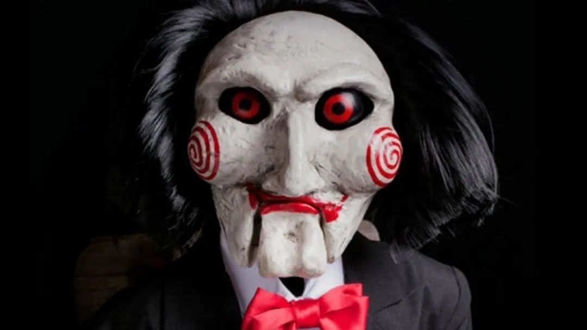
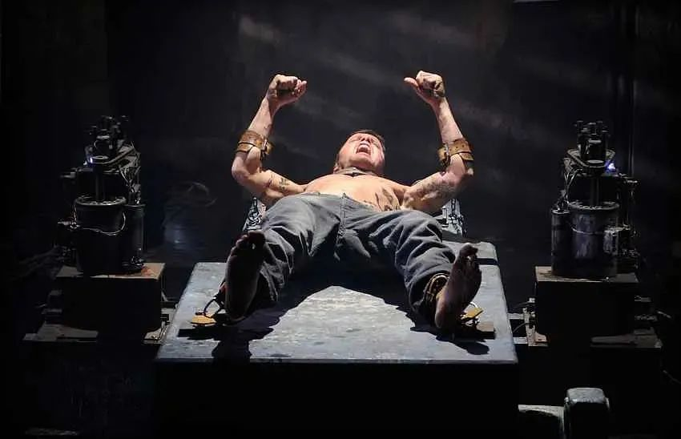

有三种恐怖片。

一种没有续集和前传。

第二种续集越拍越水，甚至沦落到录像带市场直到榨干剩余价值。

还有《电锯惊魂》这种，续集一度狗尾到让我这老粉气出眼泪，却又在拍到第十部之际谷底雄起。

《电锯惊魂10》尽管达不到最初的惊艳，起码也拉高了系列的平均水平。

考虑到这个系列顶着恐怖血浆的皮相，骨子里其实是悬疑片，咸鱼翻身就更为可贵。

老话说得好，电锯惊魂不能失去反转，就像西方不能失去耶路撒冷。

之所以每部的风评起起伏伏，成也反转，败也反转。

纵观整个系列，基本上转得好的，就拿高分，转得糊弄，就遭恶评。

第九部跌落谷底，就是无视逻辑强行搞意外，脑袋一拍就是个烂反转，比驱魔人小女孩转头还猝不及防。

同样反转，《电锯惊魂10》正好给它上一课。

说起来，这也让整个系列口碑走向像极了一个反转片，在不抱期待时突然给个大甜头。

照例提个醒，还没观影的请斟酌要不要往下读。

看过第六部我们知道，竖锯老头病危之际，考虑过一个被主流排斥的偏方治疗。

这一部就详细讲了他接触和接受治疗的过程。

结果是医生找到了，钱也交了，手术也做了，却发现被摆了一道。

肿瘤还原封不动在脑袋里，医护人员卷款跑路，太不讲医德了。

于是老头异国他乡干起本行，把无良团队全绑过来play a game吧。

游戏中途，骗子女头目逮到机会打了个电话，让男头目找上门来。

男头目当初扮演的是另一个受骗者，所以没有受到怀疑，还作为特邀嘉宾观看惩戒，成功偷袭了70岁老同志。

雌雄大骗一边把老头绑上机关，一边去楼上取钱，得意之际被锁进了毒气室。

广播传来老头销魂的声线：我早就看穿了一切，就为了让你俩就玩相爱相杀的游戏。

闪电五连鞭，原来早就预备好一鞭打一个了。

整个反转布局大致是上面这样，回顾起来也许不算多牛，但它用了不少影像手法来误导注意，延迟揭晓。

如果你是电锯粉，试着忘掉对它的了解，把自己当一个看普通爆米花电影的观众。

当男头目突然反水制服老头，这里你会觉得，哪有这么容易，多半是计划的一环吧。

接着门徒挨揍，老头承认大意了没有闪，以手扶额连连摇头，你开始相信是老头失策，但怀疑心还保持警惕。

等他跟无辜小孩一起被绑上机关，刑罚开动，画面惨不忍睹，两人命在旦夕。

这时你多少会有动摇，但还是相信主角不会失败，坏人不能得逞。

等到男女头目被大门一锁，游戏规则一变，你一拍大腿：我就说吧！

在整个过程里，电影努力把你的注意力牵制在左右摇摆里。

所以关门锁人那一环并不算什么反转，只是满足了你对商业电影邪不胜正的正常期待。

而之后交代的片段——老头早已查到男头目身份，布置引蛇出洞，偷换子弹，机关上有手脚等等——才构成真正的反转。

对多数心理防线不严密的观众而言，这个反转的力度和精密度，已经够引发心理快感。

因为只要上述闪回里有一个没料到，就能体验到智力被愚弄的爽。

毕竟看高智商悬疑，就是为了看一些合乎认知又超出思考范畴的东西。

回顾每一部《电锯惊魂》，甚至大多数悬疑片，只要有反转，基本都摆脱不了上述模板。

布置两层叙事，一层是“谁是朋友谁是敌人”、“双方谁会胜利”这样粗线条的判断。

另一层是“他怎么做到的”、“她什么时候知道的”、“他到底怎么想的”这样入微的细节描画。

目的是让观众在第一层较劲，猜对猜错都不要紧，主要是暗度陈仓把意外放在第二层。

一层大张旗鼓占据你的情绪，另一层潜移默化润物细无声。

就像魔术表演里，魔术师会用华丽而无效的大动作，来掩盖不起眼却关键的小动作。

有野心的悬疑电影会用到三层叙事，以及在每层用更加微妙的方式误导你。

比如比利·怀尔德的《控方证人》，案情破晓和动机揭示这两个通常在情绪上顺承递进的步骤，带来了两波完全不同的情绪冲击。

或是诺兰的《致命魔术》，不但两次魔术揭秘都是反转，而且打乱时间线制造了更加浓稠的迷雾。

也有功力不到家玩砸的，比如韩国翻拍《看不见的客人》在原版后面硬加了一段，效果不但蛇足还给蛇穿上了洞洞鞋。

而《电锯惊魂10》把反转模板用得工整严谨，堪比状元八股文，保险不出错的同时当然也跟出彩有不小的距离。

因此它虽然进不了系列第一梯队，但本身可以当成一把标尺，用来衡量其他悬疑电影。

反转能做得比它更精密周全的，多半是优质佳片。

而活儿干得比它还糙得多的，水平肯定就不咋的了。

你甚至可以把它定为1个标准单位，比如在我看来电锯1能有2.5个单位，而电锯9只有0.4个单位。

既然0.4能跳回到1，那当然是希望《电锯惊魂》继续多拍猛拍。

最好是今后都以1为基础，继续往高了蹦吧。

