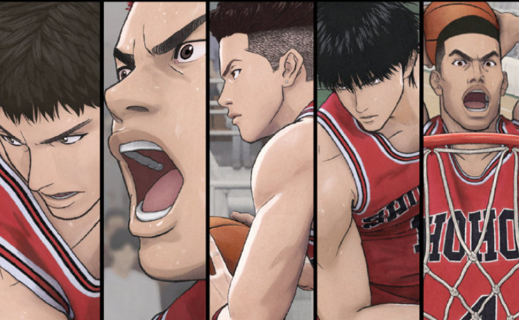
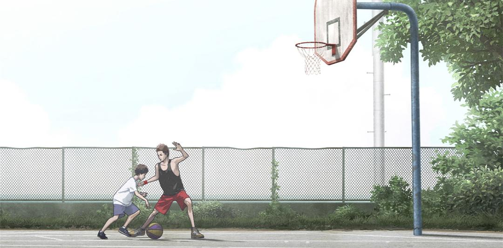
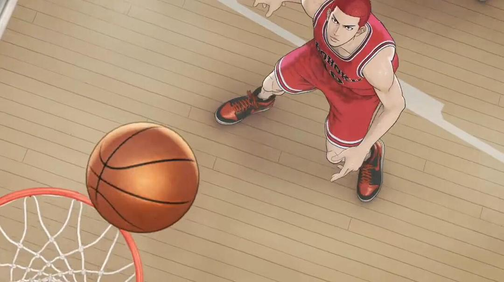
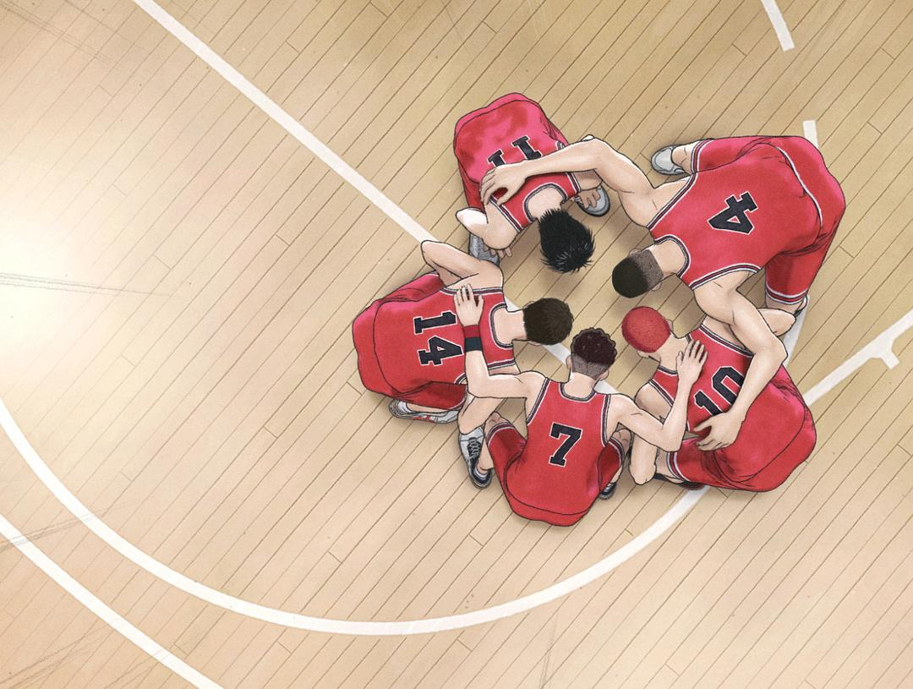

首映礼现场，和四千人一起看《灌篮高手》，心里五味杂陈。20年了，他们终于走到了全国大赛。

我为井上雄彦的电影技法、实现的视听效果而震撼，听着全场排山倒海的欢呼声跟着激动，想到自己的青春记忆热泪盈眶，同时又因宫城这条故事线，感到心疼。

这份心疼源于，想起了少时看《灌篮高手》的天真热血。我们爱《灌篮高手》，就是因为年少时心底总会有一股为梦想冲动的劲。如今长大了，与现实撞过几次“头破血流”，再看这部电影版，才逐渐理解到——《灌篮高手》真正要讲的是什么。

在歧路纵横的现实面前，普通人的梦想，没有光环，只有真心热爱。《灌篮高手》的底色，除了励志外，还包括我们该如何与人生的遗憾、创伤达成和解，如何在关键时刻做出选择。

宫城良田的治愈创伤

记得小时候大家聚在一起讨论《灌篮高手》，几乎没人会提到宫城良田。在大多数人眼中，宫城是湘北五虎里最弱的存在。不到1米7的小个头，靠多年苦练，才取得不错的球技，成为强势后卫。

宫城背后的故事，在TV版里没有详细的呈现。电影版一方面是补足，另一方面是给我们一个更真实、贴合普通人的视角。当他的故事逐渐展开时，我们才发现：这是《灌篮高手》所有故事里，最令人心疼的一个。

宫城幼年丧父，他的哥哥宗太，一个天才的篮球少年，成了家里的顶梁柱，同时也是宫城与母亲的精神支柱。但一次海难，让宫城又失去了亲人。自此八年的时间里，他都活在哥哥的阴影下，承受内心创伤带来的痛苦。宫城自我边缘化、不合群、在意他人的期待与目光，都是因为他无法填补亲人离世的丧失感，能支撑他活下去的，只有与哥哥最后的联系——篮球。

宫城总说自己的心会怦怦跳，要在紧张时装镇定。这是因为他很怕搞砸球场上的事，但他也知道，篮球是自己绝不可能放弃的东西，那是治愈自己的热爱之物。打篮球，让他阴郁的人生，逐渐迎来光亮，找到了积极活着的动力。

赛前，他说出“那本该是哥哥的战场，现在将由我站在那里”这句台词时，我也感到莫大的鼓舞。每个观众应该都会在那一刻，理解宫城一路走来的心路历程。生活就是如此，有挽回不了的遗憾，但还是要带着心里那点信念，继续往前走、往上走，拼搏地走下去。

所以我们看到，全国大赛的赛场上，湘北与山王工业展开激烈对决的同时，展开了宫城灰暗的人生过往。每个赛点，都结合进了他的情感转变，也是以他的视角，来重新打开湘北另外四位球员的人生改变。

这是TV版从没讲过的故事，也是TV版从未抵达的深度与厚度

樱木花道的“门外汉”

记得有句话流传很广：“顺境看赤木，逆境看流川，绝境看三井，期待奇迹看樱木。”

樱木花道，这个常常自诩天才、学了几个月篮球就叱咤球场的“门外汉”，一直是最受欢迎的角色。小时候看《灌篮高手》，总是惊讶于他的学习力。作为一个初学者，他在赛场上引发了太多的奇迹，且总是隔几天就能收获一些新技能。

超强的弹跳力、不可思议的起跳高度与速度、高强度防守的耐力、掌控篮板、扭转战局气势，都是他靠身体天赋与性格魅力，才能达成的奇迹。此外还有一点，是这次看电影版我才看出来的，关于他极具意志力的忍耐。

在翻滚抢球以至于背部受伤后，即使面对着有可能健康受损、缩短打球生涯的选择，樱木还是想毅然选择上场，带领湘北队在最后几分钟取得胜利。这种忍耐的意志力，很大程度上源于他是个“门外汉”。就算遍体鳞伤，他也不会对个人前景做出衡量，坚持不留退路，把自己抛出来。

“我最光辉的时刻，就是现在。”对他来说，不存在取舍，篮球就是他获得生活热情的途径。表面上看，他不是个肯忍的人，受点小委屈也要宣之于口，总是和流川枫闹矛盾。但实际上，他对求胜的意志可以压倒一切，并把忍耐的阈值调到无限高。

那一刻我才理解，井上雄彦想讲的是，樱木虽是天才，却不是传统世俗意义里的天才。在天赋极高的身体条件下，他如“门外汉”一样，没被规则束缚，没被自己的前途框定。他活在当下，活在每时每刻，不按既定的系统行事，也不给自己留一点余地，因此短短几个月造就了奇迹。

竞技体育的赛场上，最不缺的就是“意外”。曾经的强者可能会居于下风，不被看好的弱者也可能突然逆袭，直到最后一秒都要屏住呼吸。影片最后关头的高潮部分，就表达了这个内涵。全场静音无声，画风也逐渐动荡，从写实走向写意。没有一句对白，只有大量抽动的近景、特写，打破观众的预期。跑位，传球，眼神交汇，灌篮，最后定格在计分板。所有人跟着画面，紧张到心跳加速。

看电影的大多数时间里，我都在激情澎湃地“颅内高潮”。但出场后仔细回想，除了热血外，这个片子的余味，有一种如吹海风的安静感。我发现自己童年时，没能看懂井上雄彦的苦心。

在五个篮球少年的背后，更是五段不同人生方式的呈现。井上雄彦关于“歧路纵横的人生”的内核表达，也许才是《灌篮高手》成为我们这代人集体回忆的根本原因。

当生活的焦虑、困苦压上心头时，我想我会找个机会，回头重新去看看《灌篮高手》。用那份单纯的、不顾一切的真心，来面对这歧路纵横的人生。