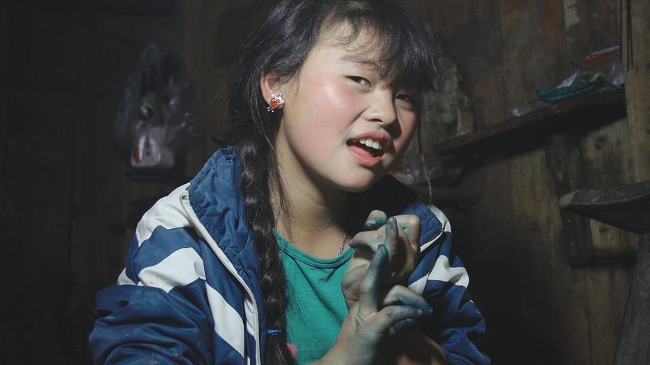
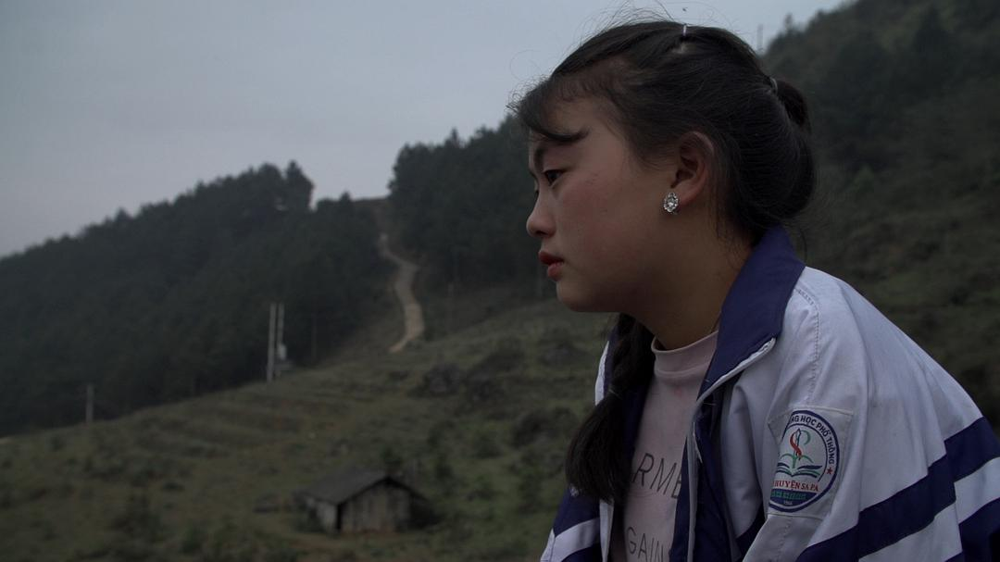
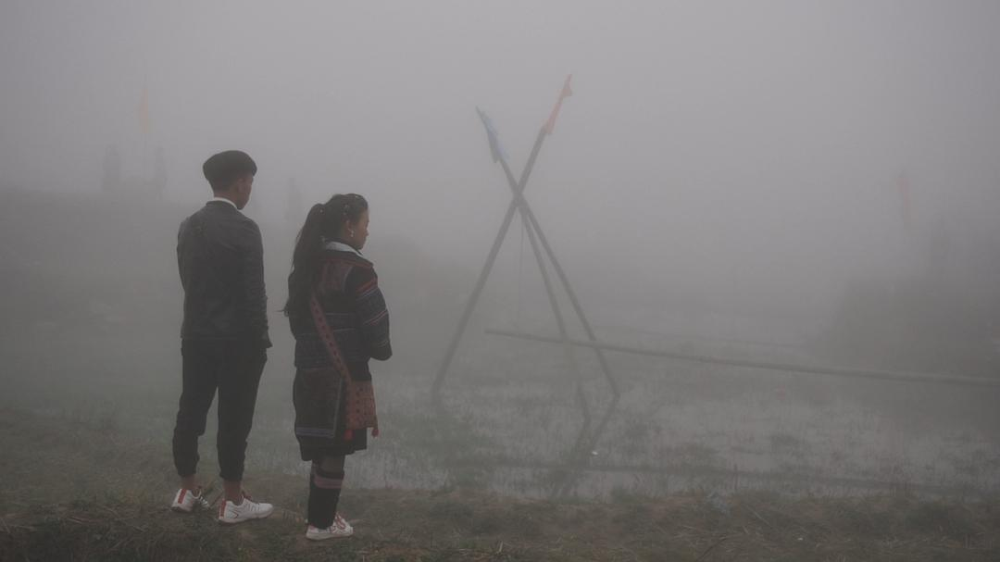

SF电影节还在进行中，这里是一些推荐影片。果然是我喜欢的城市，主流立场和文化活动导向都和我十分相合。这次影节有很多来自第三世界国家的影片，越南、缅甸、乌克兰、伊朗、巴西、苏丹、肯尼亚等等，很多关注女性议题、少数群体和弱势群体的作品。听纽约来的友邻户回说，纽约电影节就更注重艺术性，参展的大多是欧洲影片，没有三番电影节的diversity和社会关怀。出乎我意料的是向来以不爱看字幕出名的美国观众竟然坐满了这部越南纪录片的观众席。散场之后我和户回还有一位墨西哥女士F站在影院门口热烈地聊了一个小时，下一场观众都开始检票进场了我们才恋恋不舍地散场。

关于这部纪录片豆瓣的简介还比较准确：

Di與父母在雲霧裊繞的越南山區務農度日，她對外界和成長充滿好奇與想像。苗族赫蒙（Hmong）的村落裡盛行「搶婚」習俗（Bride Kidnaping），姊姊未成年就為人妻母，Di告誡自己別步上後塵，但除夕那夜，父母返家卻發現Di不見蹤影。導演長期蹲點拍攝的攝影機既親密又高度自持，呈現社會現實與紀錄片倫理的複雜度，見證並陪伴女孩們成長與自覺的過程。
影片结尾有非常激烈的段落，我们姑且称之为“高潮”。为了不多剧透，我先谈谈一些让我印象深刻的细节。

故事发生在越南Hmong族聚居的山村里，村民大多从事农业劳动：种水稻、养猪、采摘野菜等，还会用本地作物生产靛蓝后染布。

他们的居住环境非常破旧，房子看起来随时会倒塌，内部也基本没有家具。但他们的生活情景让我有些熟悉感，村民的言行举止和日常活动都和我小时候生活过的奶奶家的农村的村民们十分相似。家中用大雪碧瓶装酒，成年人骑着摩托来来去去，户外搭棚的酒席，酒桌上互相的喝酒敬酒，孩子们在野地里追逐打闹，节日的夜晚邻居们围坐一圈闲聊，逢年过节的庙会，向熟人打听其他村庄某人的家庭背景，甚至亲子之间互相嘶吼对骂都能唤起我久远的记忆片段，我都能给这些行为安上些不记得名字的老家亲属的脸。出来后和户回聊天发现她也有类似的记忆，这些生活细节都让我们更容易体会片中人物的情绪和动机，也更容易共情。你很容易想到在我们的老家或者别人的老家，都会发生类似的事情。

主人公女孩儿Di的家庭非常典型。Di的父母是抢婚结合的，父亲是个彻头彻尾的混蛋，整日酗酒、家暴、不事生产。母亲任劳任怨操持家务（我甚至发现整个山村的农活都是女人在做），总是说起自己悲惨的婚姻生活和Di早婚的姐姐，她嘱咐Di不要太早被人抢去。能感觉到她对女儿深厚的感情和依恋，但如同所有不懂得正常表达自己感情的父母那样，她对女儿表达关心的方式就是禁止她和男性过多接触，骂她是荡妇，说她如果出嫁了就没人帮她做农活了等等。同时，那个小社会里加诸于女性的“本分”和“面子”又不断撕扯着她，让她在女儿需要的时候不敢出面帮助女儿。

Di的姐姐第一次出现在镜头里时，抱着婴儿回来娘家，帮他们收割水稻。虽然早听Di的母亲说起过很多次早婚的女儿，还是对出现在镜头里过分稚嫩的脸感到惊骇。她被抢去做新娘时只有14岁，如今17岁不到已经生完一个又怀着一个了。在我认知里，这几乎是古代才会发生的事，发生在一个可以用手机连上FB，年轻人会用FB互相发消息的地方。

是的，在这个房子看起来非常简陋、几乎没有任何现代化设施和电器的山村里，孩子们都用着大屏的智能手机，会通过FB交流、窥探八卦或者和男友宣布分手，带给我强烈的割裂感。但我看到最后会替Di庆幸，我会把Di不同于她母亲她姐姐的想法并且没有落入悲剧的结局，归功于“她能自由上网”，至少她能通过网络知道外面的世界，了解其他更幸运不用早早结婚、有工作能养活自己的女性过着什么样的生活。所以她能坚定地拒绝结婚，说出“我不要结婚，我要学习，找份工作，带我妈出去看看，给她她应得的一切”或是“我以后要工作挣大钱，养很多情人”这样的话。

另一个让我吃惊的现象是孩童们对性和“抢婚”的不避讳。10岁左右的孩子会把dick挂在嘴边，母亲会说14岁的女儿horny和bitch；而所有人说到“绑架新娘”的时候都如此稀松平常，甚至拿来开玩笑，连孩子都会玩“绑架新娘”游戏，这样的态度更让人背脊发凉。片子里最让我作呕的片段是，当Di面临着男方家庭逼婚的压力跑出来透气，她父亲不仅没有安慰她保护她，还借机调戏摄像机后面的导演和Di的同龄朋友，甚至追着十多岁的小姑娘后面跑假意要抓她做新娘。太恶心了，不知廉耻的猥琐的中年人！

前面一个多小时的影片里有一些让人不适的地方，但总体还算轻松，甚至有些好笑。记录了Di的日常生活和周围人的互动。可是等到“抢了”Di的男孩Vang带着父母来到他们家，逼着Di要成为她们家的人，最后更是三个大人直接上手拖拽着已经拒绝了他们的Di往外走。

我在满座的电影院里一下崩溃了，想到那件不能提的事，想到她背后千千万万个甚至不为人知的境遇相似的妇女们，我不可遏制地哭泣，甚至都无法压低声音，我只能对旁边的女生说sorry。幸运的是我两边坐的都是女生，她们大概能非常体会面对长达十分钟被三四个大人拖拽和Di拼命挣扎的镜头带来的冲击性，同为女性的我们可以回想到人生中无数个无法在父权社会中决定自己命运的时刻，不幸的那部分甚至会受到直接的伤害。所以她们中的一个对我说Don’t be sorry. 另一个给我递了纸巾。电影散场字幕走完之后，我在电影院门口擦了会儿鼻涕，又忍不住蹲下痛哭。我一遍遍回想Di被三个大人拖着疯狂挣扎的那混乱的一幕，想着镜头后面的导演不再保持围观而是大喊“帮帮她”甚至试图去把她拉回来却做不到。我对身为女性感到深深的痛苦，替生活在某些地区的女性感到绝望，我不知道我除了蹲在那儿哭还能如何释放这些情感。这部纪录片彻底点燃了我从那件新闻发生以来积压的所有情绪，甚至是我从小到大经历的、看到的、听说的事情积压下的愤怒和痛苦。后来一位华人女士和一位墨西哥女士蹲在我旁边安慰我，说着安慰的话、给我递纸巾。我茫然地听着，却又觉得她们说的毫无作用，我忍不住说出了那件我在当时的状态下完全不可能用英语解释清楚的事件，以及我们遭遇的删帖和遗忘。已经太多次我和同样背景的女生朋友们讨论这件事，然后我们只能气愤不已，继而相对无语。我不指望她们能听明白我抽抽噎噎颠三倒四地在说什么，但我那一刻需要对一些陌生的、不懂中文的女性说出来，对着这两位相对幸运地、自由地生活着的女性诉说某些女人悲惨的遭遇，不能被提及的遭遇。

Di的母亲一再说过要等Di自己选，Di也已经当着Vang的面喝了“断交酒”，但对方家长却一再相逼，甚至说出了“你太小，不懂婚姻的好，结婚了你就懂了”诸如此类的屁话。幸好Di勇敢又坚定，不断拒绝、反抗。我都不敢想要是我，能不能像她那样坚持做出自己想要的选择，坚定地拒绝掉对方的逼迫。从“抢婚”的陋习，到父母双方碰面敲定彩礼等细节，再到两个小孩也回到女方家里做最后的决定，每一步都没有给女性选择的自由。她们只是物件、是资源，被其他男人抢去，被父母以合适的价格卖出，她们就得进入婚姻。如果不从，有的是方法逼他们就范。一个十几岁的姑娘，能如何在物理上反抗那么多大人呢？我都不忍去想，如果这次就如同过去发生过千千万万次的恶行重演，没有外人在旁边用摄像机记录，没有（老师和校长一看就不是本地的）校方打着法律的旗号来干涉，Di到底能不能挣脱开被安排的厄运？

电影中还是有些让人感动的时刻，都是Di周围的女性带来的。Di为了逃避Vang躲去学校，她妈来硬拽她回家面对Vang的时候，护住Di的是她的老师们；她被带回家之后没多久校长就带着几个老师一起来她们家，警告家长们18岁以下结婚是违法的，以此来让Di逃脱被男方家逼迫结婚的命运；后来Di上学的时候老师还特意找她单独聊天，说她太年轻了，还不能了解现在辍学结婚会有什么样的后果，鼓励她好好读书，拒绝对方家长的要求。

导演在拍摄过程中在最危急的时刻也试图帮助Di，甚至能感觉到导演爆发的情绪，这其实是有违纪录片的拍摄准则的。但是，去TM的准则吧，看着可怕的一幕发生，作为一个正常的、有良知的人都很难继续袖手旁观。看到最后突然更深地理解了导演在开场镜头里略带悲伤的旁白：我舍不得Di，我和她一起度过了三年时光。我是Di的好朋友，也是她的姐妹。

这是导演Ha Le Diem的第一部长片，已经非常优秀。能感受到导演对素材精心的剪辑和安排，也能大概揣摩她拍摄此题材的动机，出自一个越南女性对另一群越南女性的关注和同情。她的作品如实记录了当下越南某些地区正在发生的事，也让更多人了解遥远的地区在发生着什么，我想这两点就是纪录片最重要的意义。（由此不难猜测为什么某些地方几乎没有反应社会问题的纪录片的存在，因为只有他们告诉的版本才是真实）有趣的是，因为Hmong族有他们自己的语言，区别于导演所讲的越南语，很多时候她都不太明白被拍摄者在讲些什么。
