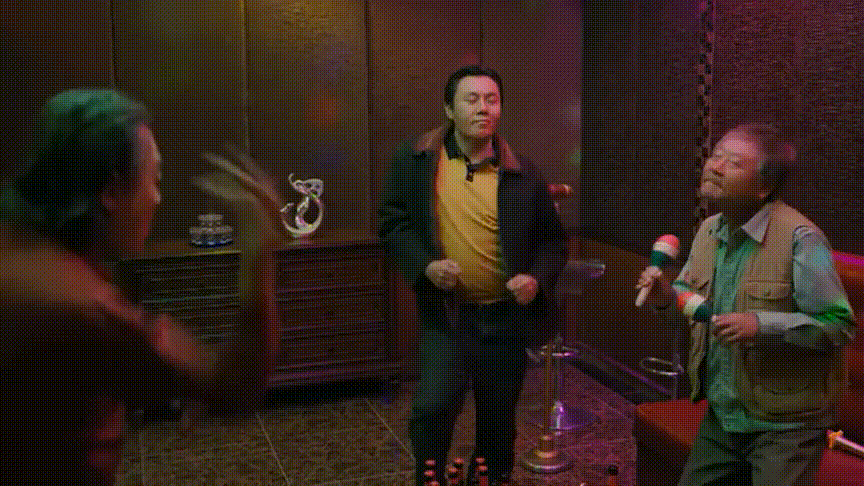
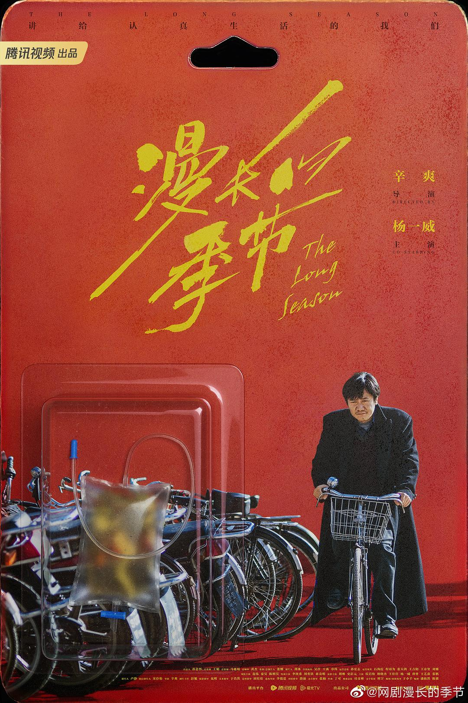

姜育恒沧桑的声音响起，《漫长的季节》终以一曲《再回首》结束了它忧伤而遥远的故事。

在前面11集诸多现代前卫的插曲和片尾曲播放时，我曾想过，为何没有一首九零年代的歌带我们直接进入那个年代。像贾樟柯在电影中插入叶倩文的《珍重》，自然摇动人们怀旧的细胞，通过那温情的旋律反复确认，是的，这是浪漫的九零年代。

然而《漫长的季节》似乎要说一个截然不同的九零年代的故事。它选择慢慢讲述巨变，选择温暖而明亮的季节描绘人们心中萧索寒冷的北方，选择用近乎与现实动作同步的拍摄节奏，呈现一个已被浓厚滤镜罩住的时代。当范伟骑着他的大杠自行车从小坡上忧愁地滑行下来，当老太太拖着垃圾车一点一点吃力地跨上台阶，当孩子在铁轨上朗诵一首还未写完的诗……没有什么是迅速的，一切都像是实际能够感知的节奏。但对现在的观众来说，已经太慢，太慢，包子还在秋天的夜晚慢慢冒着热气，嗖忽之间，年轻的人老去，存在的事物消失。

对时间分量的感受成了我初看这部剧时最为迷惑的部分。像一座巨大的迷宫，忽而我可以慢慢欣赏周边的风景，忽而我不知道进了什么胡同，怎么也走不通。走了大半程回过头来，才发现迷宫的地图原来是这样：《漫长的季节》有三个时间段的故事，交叉跳跃进行。它们各自的悲喜轻重掂量着那时间段里人们生命的重量。最终，不同人的命运汇入同一条河流，那条河流看似平静，却已走过千山万水。

从1997年至2017年，跨越20年的故事，野心勃勃地描绘了一幅时代图景。在我们熟悉的语境里，那个时代从来都与昂扬激荡、乐观奋进相关，人们走向光明的未来，迎来千禧年、迎来新世纪。但是，《漫长的季节》何其残忍。“王响，响亮的响”，“王阳，太阳的阳”，人如其名，却纷纷迎来截然相反的命运。于是一组曾经在记忆中宏伟而温馨的时代景象，终于被这些故事的拼图“肢解”——它们呈现出真实的样子，令人沮丧、失望的样子。无数失落的细节拼出另一种图案，使我们终于记起来，那时不是所有人都有美好的前程走向了光明的未来。

