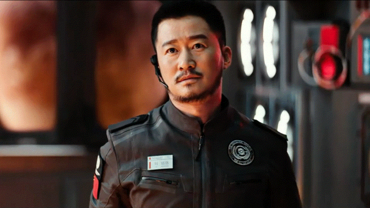
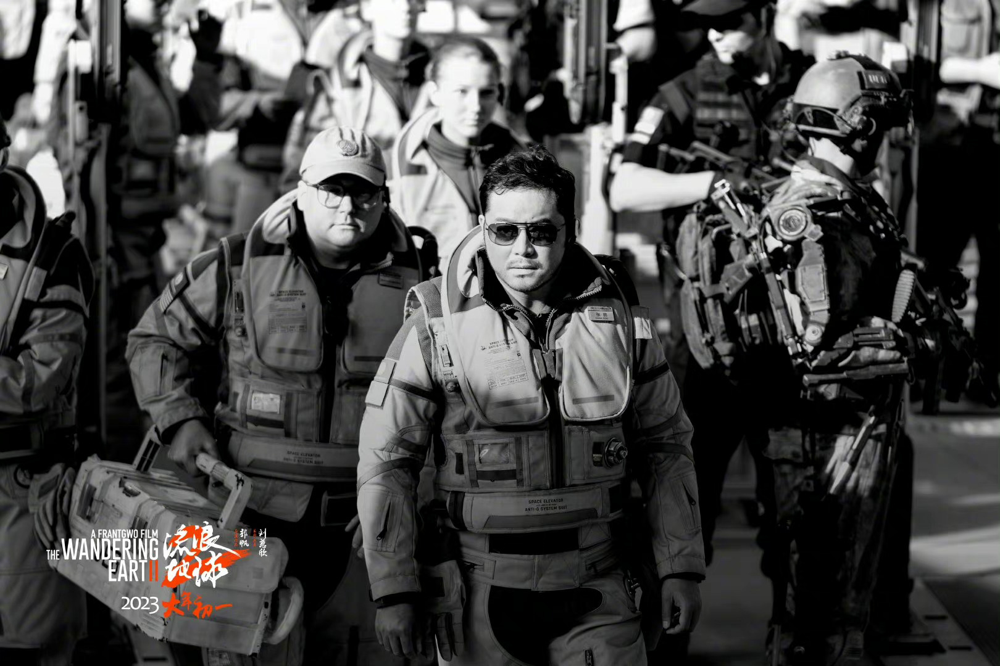

   
   
 “中国电影试图将我们的星球带离太阳系，在它的故事情节中有一个前所未见的元素，它看起来甚至超越了好莱坞的标准。中国电影终于加入了太空竞赛。”这是《流浪地球》当年引发全球轰动时，印度媒体给出的评价。

《流浪地球》太成功了，让人有点担心：《流浪地球2》还能怎么创新？毕竟，“画面感＋幽默对话＋紧张情节”三板斧都用过了，还能再加什么？

必须承认，与《流浪地球》相比，《流浪地球2》的画面感与情节紧凑感更胜一筹。影片一开始的“太空电梯被袭击”，堪称视觉盛宴。“太空电梯”是著名科普小说家阿瑟·克拉克1978年在《天堂之泉》中构想出的太空运输方式，它模仿电梯，将飞船送入太空，成本低，安全性高。预计2050年，人类将铺装完成第一条“太空电梯”线。可“太空电梯”究竟什么样、如何运作，普通观众无直观感受。《流浪地球2》则呈现出它的壮观，特别是它在敌人的进攻中被摧毁时的场景，即令阅片无数，也会被震撼，堪称巅峰级。

此外，《流浪地球2》的感情戏更深入，着墨不多，但叙事完整、感人至深，人物塑造上也更深入。

不过，《流浪地球2》最打动我的，还是它的另一故事线，主角是图恒宇（刘德华饰）和马兆（宁理饰），它不以视效取胜（当然，视效也很棒），而是以逻辑取胜，可称是“烧脑线”，这在国产科幻片中极罕见，其高级程度堪与诺兰比肩。

第二路径可能更靠谱

从故事看，《流浪地球2》是《流浪地球》的前篇。

《流浪地球》的矛盾设置相对简单：正奔出太阳系的地球遭遇技术困境，很可能与木星相撞，导致人类毁灭。末日之下，人类展现出自我牺牲精神，最终完成了不可能完成的任务。

《流浪地球2》则既保留了这一矛盾，还隐含了另一个核心矛盾：不同技术路径之间的冲突。

其一是物理路径。即在地球上建造1万多个发动机，推动地球离开太阳系，躲避太阳系即将崩溃的风险。

其二是数字路径。即将人类的意识上传到电脑中，成为虚拟生命，再将相关信息传导到其他行星中，保留人类文明的火种。

前一路径易理解，后一较难。

其实，美国学者雷·库兹韦尔在《奇点临近》中早就谈到这一技术可能。电脑经40—50年的发展，智力已基本相当于人脑的1/10，且仍在加速增长。那么，再有40年，电脑的能力可能超越人脑的1000倍，甚至10000倍。

在今天，把人类意识上传到电脑中，看似荒唐，可当电脑能力相当于一个自然村，甚至一个镇的人类智商总和时，人脑还有什么秘密可言呢？

遗憾的是，直到今天，仍有很多人坚信，生化反应不可替代、具有超能力，不相信电脑能超越人脑。当如果电脑参透了人脑的一切弯弯绕，那么，人脑为什么不能被数字化，活在电脑中？

如果人类真的变成数字生命，那么，太空移民就会变得很简单——通过虫洞，每秒理论上可传输几百K信息，人类可以通过它，将个人的DNA传到几千光年外的另一星球上，在那里克隆出另一个“我”，然后再把我的大脑信息传过去，那么，“我”就等于出现在其他星球上，完成了太空旅行。

显然，数字路径风险小、安全度高、成本低。采取物理路径，用发动机推动地球旅行，万一能源不够怎么办？遭遇路上发生碰撞怎么办？出现意外情况怎么办？人类文字记录的历史不过几千年，我们现有记录不足以应对万年尺度的意外事件，何况我们对地球外的意外事件了解更少。

怪不得在《流浪地球2》中，为什么这么多人反对物理路径，甚至多地出现动乱，因为它确实有点像集体自杀。

路错了，也得走下去

那么，为什么不采取数字路径呢？

在《流浪地球2》中，也明确提到了，各国对数字路径也进行过尝试，但遭遇伦理、法律等困境，只能全面停止实验。

从伦理、法律说，基础是“我”只有一个，“我”的生命是有限的。如存在数字生命，“我”就可以拷贝克隆，如果违法犯罪，谁来负责呢？如果别人入侵了电脑中的“我”，“我”还是“我”吗？如果“我”的寿命是无限的，那么，法律真能约束“我”吗？如果大家都生活在电脑中，父子关系、夫妻关系之类，该怎么算呢？

在《流浪地球2》中，马兆只相信“物理存在”，但他又对图恒宇丧女充满同情，对图恒宇违法进行数字生命研究，睁一只眼闭一只眼。

数字生命的最大问题在于，它改变了“活着”“死亡”等定义。

生活在三维世界中，我们眼中的时间是一条放射线，只能往前走，不能往后退，“活着”“死亡”都是一次性的，但这个经验未必适合四维世界。如果我们活在四位世界，时间不仅可前行，也可后退，人们生活在不同的时空盒中，彼此未必是线性逻辑的关系，那么，我们就应该重新去理解“活着”“死亡”。

两种路径的基本立场完全不一样，但都需要最先进的量子计算机支撑，当图恒宇私自使用量子计算机去重建死于车祸的女儿的数字生命时，原本的时空线性运算秩序便崩溃了，危急整个系统，物理路径遭遇巨大空前挑战。

可问题是，物理路径本身也是在巨大压力下不得不做出的选择。太阳系崩溃在即，物理路径一旦耽误，就会完全失效。物理路径未必是更优技术，但是短时期能应用起来的技术，在人类史上，经常出现这种新旧系统博弈，而决定博弈结果的未必是“最优方案”，它存在路径依赖——一开始选择了什么，后来只能沿着这个大方向前行，可能更好的技术路径将被放弃。正如常有专业人员感慨说，如果早期汽车不设计成燃油机推动，那么人类早已普及清洁的电动汽车了。

人类天性不知“无”

在《流浪地球2》中，物理路径几度遭破坏，这个“敌人”不是来自外部，而是来自人类内部，因为许多人坚持数字路径。

支撑图恒宇的，倒不是技术路线之争，而是他对女儿难以割舍的爱，给反对物理路径的人创造了机会。可吊诡的是，正因为爱，也让刘培强（吴京饰）重新加入战队——全家只有他一人拥有躲入地下城的名额，为了儿子活下去，他宁愿丧失自己的生命。

同样是爱，结果却相反。片中周喆直（李雪健饰）感慨道，人类把最精密的保密系统，都用在了互相毁灭之上。然而，同样是人类，影片中200多名宇航员为拯救地球，集体引爆核弹——他们明知那是单行票，他们也可以逃避责任，但他们还是选择了集体牺牲。

《流浪地球2》准确地把握了情感悖论——人类渴望公平，但危机面前，没有公平，只有责任。那些最优秀的、最负责的人，可能最先被毁灭，但正因如此，人类才成长为地球上最强大的物种，才成为唯一能突破地球引力限制的物种。

坦率说，这种哲学层面的思考因饱含悲悯意味，更打动心灵。毕竟，站在大时空的视角，一切皆空，我们为什么还要奋斗呢？因为对于“空”，人类有“必要的无知”，当我们说“一切”“无限”“永恒”时，本身就意味着“有”。人类永远不会真正理解“空”，我们只能认识“有”，所以人类一直在进步，一直在超越，一直想看到更广阔的世界。

这就可以理解，为什么片中图恒宇在被淹死前，让虚拟空间中的女儿记住他手中的密码，因为他坚信，数字生命也是生命——值得注意的是，《流浪星球2》中，图恒宇穿越时空时，也用打开房门来隐喻进入新时空，这是“诺兰迷”们熟悉的设定。

它的魅力，在于刷新宇宙观

《流浪地球2》中出彩的地方有很多，为什么我特别看重其中的诺兰风格？原因大概有四：

首先，《流浪地球2》的视效非常好，堪比美国大片，与国内一般影片的视效比，胜在想象力突出，很多高科技元素撑爆眼球。但视效总是长江后浪推前浪，未来的创作者总会做得比今天更好，一个作品想传诸久远，视效是必须的元素，但不是唯一的元素。

其次，科技含量长期是国产科幻片的短板，体现在“有技无科”，一说科技，就是应用层面的技术，很少有对宇宙、对时间、对结构的思考，似乎仍未摆脱有四大发明、无微积分的传统，在《流浪地球1》中，这一点也略显薄弱，《流浪地球2》则完全刷新了观众的宇宙观。

其三，基于对时间的深刻认识，《流浪地球2》更准确地把握了矛盾，突破了“好人打败坏人”的“小孩儿过家家式”的叙事窠臼，不只以情动人，且能以理服人，不仅催泪，而且健脑。

其四，突出雄壮美，使儿女之情得到有效升华。庄子说：“小知不如大知，小年不如大年。”思考的尺度增加，力度也会增加。

如果说《流浪地球》是一部可以比肩美国大片的佳作，那么，《流浪地球2》则呈现出了史诗与经典的意味。这类创作越多，国产片就越受尊重，地位也会越高。

