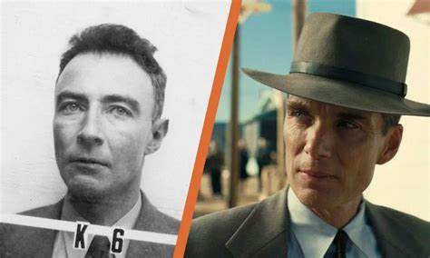
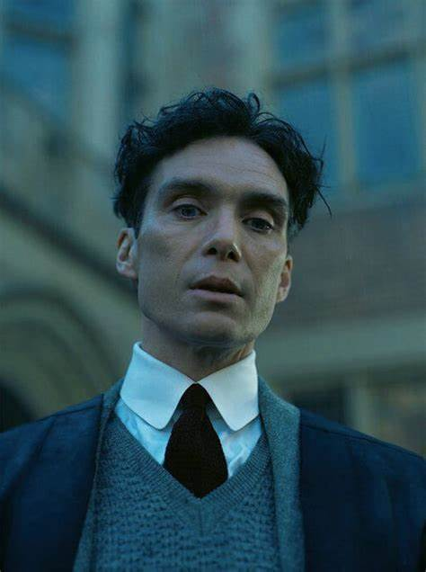

   

很遗憾看到诺兰在创作上已变得如此僵化。影片从起幅到落幕，满坑满谷的角色登场谢幕，然而在如此庞大的群像之中，我却无法真正地“看到”哪怕一个人物，包括奥本海默本人。每位演员的表演都没有问题，哪怕是一些脸谱化的角色，如玻尔、爱因斯坦、杜鲁门等等，也都看得出在表演上出色地完成了任务。但我还是“看不到”他们，看不到这些演员作为历史人物的情绪与状态，问题出在哪里？我想，似乎是因为作者只采纳了人物的言语，却没能采纳人物的心理，让整部影片变成了一场关于“自由间接话语”的幼稚游戏，以至于那些特写和近景镜头，仿佛都成了空镜，无法帮助观众靠近并凝视人物，与之产生链接。

这一次，多重时空的交织不再是为了谜题和杂耍，或者炫耀诺兰那些复杂跳跃的影像构思，但随之引发的，则是影片异常单调的转场逻辑。在奥本海默攀登顶峰的时期，影片是彩色的，在他作为普罗米修斯被审判之后，影片遁入黑白。或者你也可以理解成，以奥本海默作为叙事视点时是彩色的，施特劳斯为叙事视点时是黑白的。但无论如何，色彩的切换无疑揭示出（作为导演立场的）奥本海默在人生的两个阶段，对待世界的不同态度。从这个层面上说，整部影片甚至可以看作是一个完整的奥本海默主观镜头，这样的立意每个人都很容易解读到。但从美学上讲，这种手法毫无新意，我们在许多以镜像世界为故事背景、或者是讲述梦想与现实的影片中都体会过。而对于本片来说，因为对人物的描述近乎溃败，这个手法充其量只是标记出了一种视觉效果，一个时空刻度，至少从色彩以外的维度，我无法感受到两个世界带给我的那种真正巨大的情感落差。

同样的，影片有许多古典主义的叙事手法，被生硬安插在了诺兰一贯的现代性结构之中，导致观感时而保守时而激进，引发强烈的断奏感。比如奥本海默在欧洲求学时陷入迷茫，或者在讲述他的理论成果时，影片均毫无意外地插入了一些宇宙奇观的镜头，给我的第一反应，无非是增加一些视觉奇观，是一种作为大制作电影的商业指标的体现，却不能带给我真正的从视觉到心理上的冲击力。而声音，作为占据这部影片主导地位的叙事元素，在使用上反而是相当陈旧迂腐的。密集的弦乐与合成器音墙自不必说，这是诺兰一直以来的风味，而于静谧处猛然爆发的巨大混响，也只是无数类型片甚至流行音乐中的常规技巧而已，只是在影院的声场下来得更为猛烈惊怖罢了。在我看来，对声音的如此运用也只是强行拨弄着观众的生理反应，根本无法带来“纯视听情境”应有的巨大表意张力。在这一点上，阿彼察邦的《记忆》要比本片巧妙出色得多。

并不是说古典主义叙事法就一定过时了，比如今年同样跟科学家和原子弹有些关系的《小行星城》，就是一部主打复古套路的年代戏，同样黑白彩色区分舞台内外，同样众星云集。在那里，配合韦斯·安德森标志性的影像风格，古典主义叙事法发挥出了全部能量。当然，《小行星城》有着属于自己的致命问题，在这里就不展开说了。

另一方面，作为一部对白密集、充满结构主义意味的电影，《奥本海默》通过时空交织下的蒙太奇语言，着重展现了各色人物的唇舌之争，有些争吵在镜头的编排下，甚至跨越了十几年。密集的台词很容易让人联想到昆汀、伍迪·艾伦和阿伦·索金，但诺兰对台词的创作态度显然不如那些人深刻，台词处理既不诙谐、也不犀利、更不刻薄。当然，你可以认为台词并不一定要有这些，让人物正常说话也能飘荡出悠扬深远的思绪，正如曾经的理查德·林克莱特那样。然而，问题的关键在于，《奥本海默》在台词文本上不仅不提供尖锐性的批判，同时也不提供对个体困境与时代症候崭新而深入的讨论，有的只是重复关于历史、意识形态、官僚与道德社会的陈词滥调。而我们能从片中感受到的悲悯、愤怒与无奈，只是影片用一些极为浅显的能指符号引导出了我们的常识性经验。反观影片本身，却是人物说的越多，意涵就越显贫瘠，影像与声音也就越发浅薄干涩。爆炸式的音效与斑斓的广角镜头，反而看起来更像是遮掩表意话语的苍白。

此外还存在一些不那么致命，但可能会影响观感或让影片冗余的问题，比如叙事节奏上，依旧是诺兰的老毛病，均匀而机械，以及只靠言语-记忆-线索单一维度的时空组接，很难形成有效的表意张力。同时，影片在细微之处还是安排了一些谜题，如潜伏在洛斯阿拉莫斯的苏联间谍，如到底谁给博登看了奥本海默的档案，如爱因斯坦跟奥本海默到底谈到了什么？是不是跟施特劳斯有关？以及最后施特劳斯身份的反转等等。但这些都不具备构成叙事的悬念推力，自然也就没能提供更多叙事上的趣味。

写到这里，我再回想自己为什么“看不到”《奥本海默》里的人物，也许是因为影片对奥本海默缺少一些客体主观化镜头的展现，以至于特写镜头总是显得隔着一层障碍，难以深入内心。比如关于他妻子、孩子、同事、情人的戏份要么比较稀疏，要么相当刻板脸谱（对凯蒂和琼，也只是流于表面的常规剧作模式）；比如无论在主角还是配角上，都没有找到那种灵光一现的反差时刻；比如人物一直被各种矛盾和危机牵着走，却缺少真正直击其情绪的反应段落。影片还试图用原子弹去映射奥本海默的命运，用“聚变”与“裂变”去概括他对于不同时期、不同身份的矛盾状态，但在整个三小时的剧作流程中，这些意象又缺少足够明确的互文性……

总之，《奥本海默》试图做出一种有别于诺兰以前的电影，一部以克制性表达为主、同时又能兼顾他的结构美学的文艺片。但事实证明，诺兰在对文戏的创作编排上仍有许多值得精进推敲的地方，那些故意克制的视点调度和文本桥段——如美国投下两颗原子弹之后、屈辱的听证会等等——不仅没能凝练出人物更深层的心理内蕴，反而因为张扬的配乐、音效和氛围被冲散了基调。以及对人物塑造的能力，在以前诺兰的奇观电影中是够用的，如英雄主义语境下的《黑暗骑士》、迷宫诡计下的《盗梦空间》、还有《星际穿越》的奇观冒险等等，但当他聚焦到这种非奇观形象的普通人身上时，就显得有些捉襟见肘了。

作为影迷，我很敬重克里斯托弗·诺兰，不止是因为他拍过一些令人爽快的电影，更是源于他对一种正确电影观的坚守，比如对大银幕观影的毫不退让，对胶片的情怀与执念等等。但如今《信条》和《奥本海默》这接连两部作品，都带给我不少遗憾，心里也难免感到惋惜。诺兰似乎陷入到一种创作迷思之中，亦或者他一直擅长的技巧和风格，并没有丰富到支撑他所有的创作动机和野心。此时此刻，我不由得不负责任地猜想，也许对诺兰来说，彻底抛弃所有的类型元素，才能使他离真正的大师更进一步吧。
