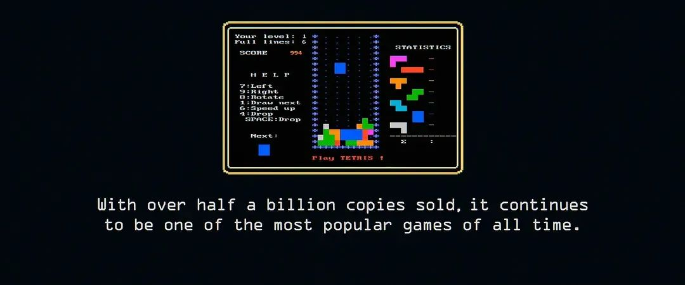
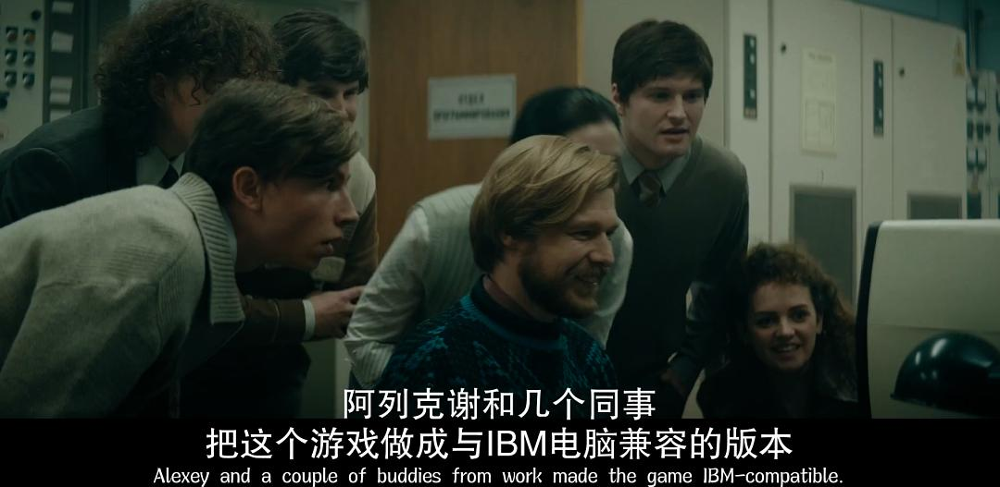

   

很难想象，“俄罗斯方块”要如何改编成一部电影，在游戏IP电影化大行其道的时代里，“俄罗斯方块”这款几乎是地球上最知名的游戏，注定是要加入这股浪潮的，但游戏本身极简的玩法和零背景及故事信息的设定，又天然与电影语言相悖。所以，当我们看到一部名为《俄罗斯方块》且海报、故事的确又与“俄罗斯方块”游戏强相关的电影时，不禁陷入困惑，恨不得马上点开播放按钮，探个究竟。

看完电影，便释然了，《俄罗斯方块》是部围绕同名游戏在诞生之后如何踏破铁幕走向全球的故事，它也非纪录片，而是借用了历史上有关“俄罗斯方块”这个游戏发展史的一段小幕后，以及对那个时代带有极强的胜利者回望姿态，进行大量改编，最后炮制出了一部类似《窃听风暴》、《逃离德黑兰》式口味的政治惊悚片。

1984年6月6日，苏联科学院计算中心，28岁的程序员阿列克谢·帕基特诺夫发明了“俄罗斯方块”这款游戏，很快，这款小游戏成为了科学院中心同事们日常最爱的消遣。再然后，游戏向整个国家流传开。又很快，西方资本主义商人们，嗅到游戏里的巨大商机。纷纷向那个神秘的国家抛去合作意向，愿花费高额费用购买授权，以便向全球范围推广这款游戏。电影《俄罗斯方块》的故事内容基本由这个背景出发，讲述了任天堂荷兰裔游戏设计师罗杰斯为了获得“俄罗斯方块”的版权，一方面与英国麦克斯韦掌舵的传媒巨头镜报公司斗智斗勇，另一方面深入冷战时期的苏联，与苏联当局ELORG机构谈判。故事最后，罗杰斯一行人有惊无险地获得授权，“俄罗斯方块”搭载那一年任天堂推出的“Game boy”掌机，两者相辅相成，迅速风靡全球。

 

看这个片子，我个人的观感是割裂的。首先，电影在某些层面，我是很喜欢的。包括片头片尾及故事讲述过程中的篇章设计等，通篇借用“俄罗斯方块”游戏的元素，让人愉悦、充满好感。其次包括“俄罗斯方块”游戏强相关的一些信息内容，它的诞生、演变、传播，仍旧让人觉得神奇。但让人觉得片子稍显陈旧与无聊的，同时让我始料未及的是，当故事里的主角，游戏设计师罗杰斯一踏入苏联，或者说，只要电影镜头对准苏联，所展现的任何内容，便立马呈现出一股负面的、固化的审视与批判视角，与前景内容有所割裂。

你要说这片子不好看吧？真不能这么说，片子拍得相当好看，主要是剧本做得好，故事紧凑、紧张、刺激，通篇夹杂着一股自由主义对曾经的苏联集权铁幕的鞭尸。但你要说好看吧？又总感到哪哪不对，觉得片子里极强地昭然若揭式的“历史胜利者叙述视角”，充满了美式傲慢、轻佻与自以为是，倒不是说美国人这么拍片不对不可以，关键是看得太多了，套路太明显，几十年前，美国人怎么拍苏联，这部2023年的《俄罗斯方块》，依然怎么拍苏联，里面的好几场戏就像是从其他电影里直接复制粘贴过来的，很没新意。以及内心里始终觉得，有关“俄罗斯方块”的故事，实在没必要也往这个方向去讲述嘛。何况历史上的真实故事，的确没有那么多与政治相关的弯弯绕绕，男主的现实原型，接受采访时，也表示这只是个好莱坞剧本，与历史无关。

历史上，1989年7月，“俄罗斯方块”捆绑Game Boy掌机在北美市场发售，总销量逾3500万套，成为Game Boy史上最畅销游戏。“俄罗斯方块”成就了Game Boy，Game Boy成就了“俄罗斯方块”。“俄罗斯方块”为任天堂带来丰厚收入，而身为作者的帕基特诺夫却没能拿到一分钱。两年后，苏联解体，在罗杰斯帮助下，帕基特诺夫一家人移居美国。1996年，两人成立俄罗斯方块公司，“俄罗斯方块”游戏版权也重回到帕基特诺夫手中。很多时候，历史的荒谬、奇妙与有趣往往就在最简单的事实里。

从电影本身出发，不可否认，《俄罗斯方块》是部值得一看的作品，电影通过加入一些耸动的内容，让片子具有强烈观赏性，窃听、追车、盘问、围剿，就像是电影里高压环境下，“俄罗斯方块”游戏的原作者被描写成失语的模糊的配角形象，在《俄罗斯方块》电影里，“俄罗斯方块”游戏本身似乎也没那么重要，在这部模版化的、套路的政治惊悚类型片里，“俄罗斯方块”作为引子，似乎可以替换为任何其他事物。