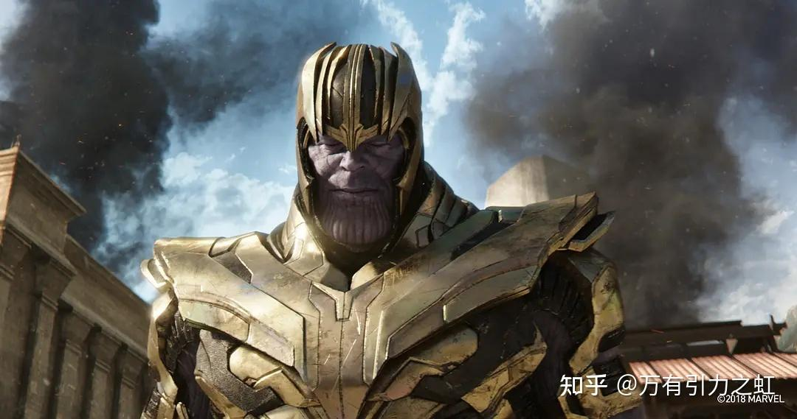
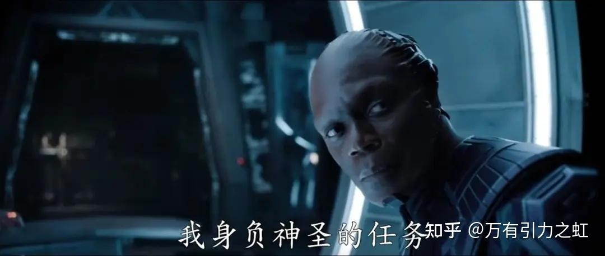

奥斯维辛集中营、诺亚方舟、创造亚当、反纳粹、反乌托邦、反未来主义……银河护卫队Vol.3绝非只有插科打诨和金曲串烧，滚导在这部电影里想讲述很多东西，不只是guardians完美的结局和rocket悲惨的身世——其实完成到这里，也足够漫威粉满意了。

当然，我并不是漫威粉，某种程度上我prefer隔壁DC的更加“电影”的风格。所以滚导在这部电影里的自我表达着实让我眼前一亮，在纯商业的（漫威）超英片中难得一见。

滚导的思考延续了灭霸杀一半人救另一半人的电车难题，也是神性和人性之间的矛盾。也许从宏大叙事的角度来看，灭霸似乎是正确的，消灭一半人来为另一半人求得生存空间，以解决宇宙层面上无限增长的人口和有限的资源之间的矛盾。而从人本主义的角度看，蔑视任何人的生命都是不可取的，为了宇宙的科学发展而消灭一半人类被看作是荒谬的极端的疯狂的。

 

 所谓人性与神性之争，就是指从人本角度看问题还是从宏大叙事者的角度看问题。银护3的反派就是一个宏大叙事者，他为了自己的社会理想，为了创造自己心目中的乌托邦，进行各种生物实验，使其达成最完美的形态。无论小到一只浣熊还是大到一个星球，只要不够完美，没有满足他变态的心理欲望或者说没有实现他宏伟的社会理想，他便会推倒重来——就像对待无用的棋子和积木一样随意摧毁他所创造的一切生命。

 反派“至高进化”和阿道夫希特勒有相似之处。他们的屠杀不是为了达成具体目的而采取的必要措施，也不是泄一己私愤，仅仅是因为他们认为一部分人不应该出现在理想社会中，仅仅因为他们认为这些人不完美或者没有高洁的血统。此所谓极端之恶（radical evil），这个词并非指杀戮的残暴程度，而是指向杀戮的不可理解性：在传统理念中，人的尊严和价值顶多被践踏为工具，就比如康德说人是一个作为目的的存在，而不仅仅是任何发展的工具，但是在至高进化和希特勒看来，人甚至连工具都算不上。他们革除了人的根本概念，将一部分人仅仅视作亟需清理的垃圾和杂质。（当然，如果你读过鲍曼的《现代性和大屠杀》或者汉娜阿伦特的《艾希曼在耶路撒冷》，就知道那些大屠杀执行者并非十恶不赦的失心疯子，相反，他们逻辑缜密、思维敏捷、文化造诣和科学素养都极高，平日里也温文尔雅、恪守道德。惨绝人寰的屠杀实际上来源于现代性——基于计算之上的绝对的客观理性，换句话说就是冷漠的机械思维，或者说是以结果为导向的工具理性。很遗憾影片中这部分未能呈现，而仅仅是将反派塑造成了一个“只是不满现状”的偏执狂。）

这里可以提一下乌托邦。理想国，柏拉图的诅咒。历史上所有试图建造理想社会的人，最终都将通往天堂的道路砌向了地狱。两生花。柏拉图的理想国和孔夫子克己复礼的社会理想在一些方面是相近的，一个是因为伯利克里时期开放的雅典城邦不可避免的失序，一个是因为春秋的礼崩乐坏，两位古代先贤的社会理想现在看来，不过是历史的逆潮，一个是在开放社会怀念封闭社会，一个是在封建社会招魂奴隶社会。为什么波普尔在《开放社会及其敌人》中说集权领导下的社会工程不好？因为人类历史进程的不可预测性。纯粹的理想主义者仅仅关注自己的理想，历史主义者总是误读历史意义，总是试图找到人类走的那条唯一的、决定的路。不多言……

银河护卫队3再次强调了人文主义精神，无论是火箭浣熊的成长故事线（这一条线的视听语言非常优秀），还是拯救飞船上所有的生灵，还是星爵和术士亚当在太空中“偶然”形成的《创造亚当》。

《创造亚当》是米开朗基罗所作《创世纪》大壁画中最动人心弦的一幅名画，在上帝和亚当手指即将相触的一瞬间，一人一神奇妙的并列在了一起。整幅画的寓意在于“天赋并不来自于神，而来自于我们自己的思想”。这里所谓的最宝贵的思想与意识指的就是人文主义精神——看重每一条生命，这也正是创世纪的思想基础。当那些小孩子、改造的生物、猪、猴、熊各种动物还有血盆大口的怪物从至高进化的即将爆炸的飞船逃到星爵买下的虚无之境时，很难不想到在大洪水中承载一切希望的诺亚方舟——也许正是MCU的天神不满至高进化所创立的社会，便推倒重来，将建立新社会的重任交付到银河护卫队的肩上，从此刻开始，他们就要以人文主义为基础建设他们的社会，在宇宙中驾驶自己的方舟，没有谁是他们的救世主，只有他们，是自己的诺亚。
