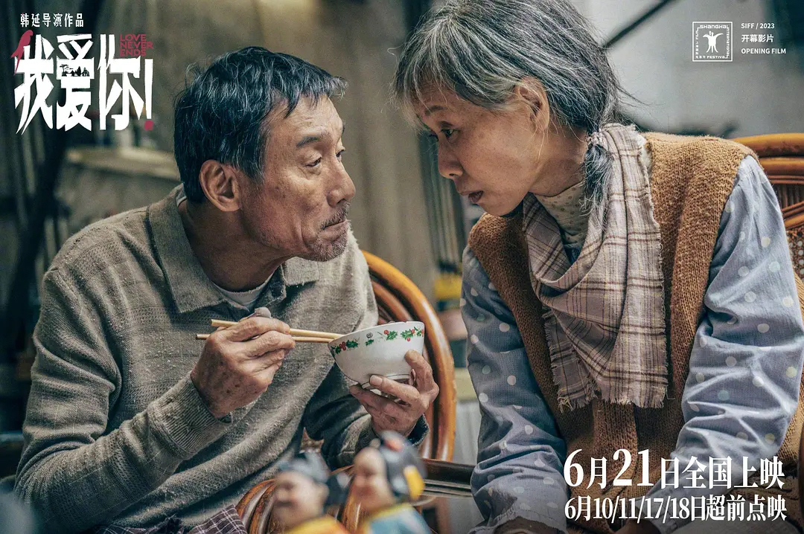
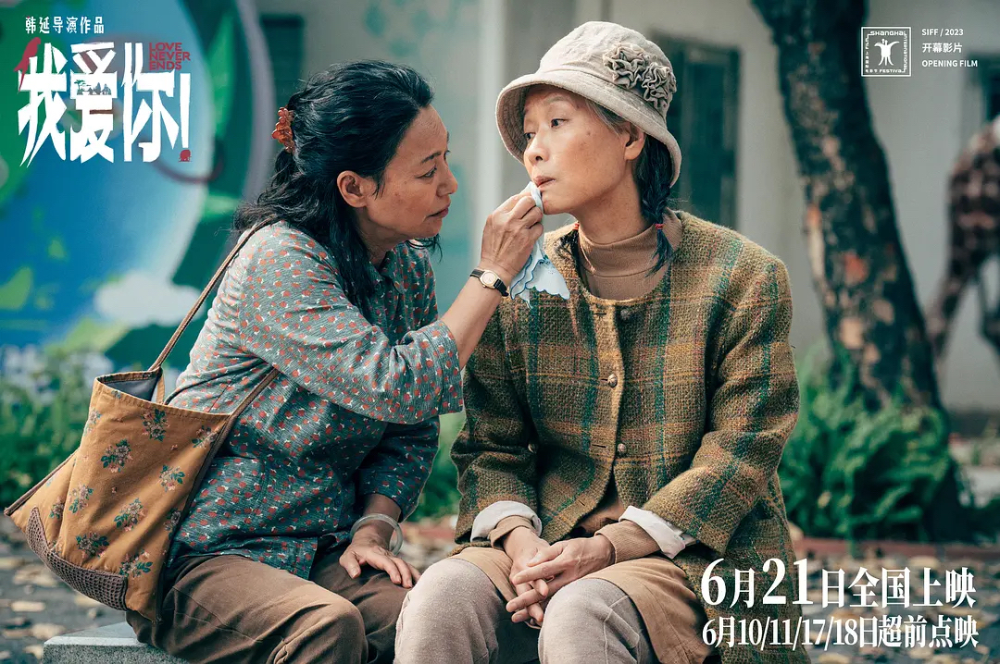

你是否想过老去后的我们还能像现在一样深爱着彼此吗？如今的我们啊，好像看过太多以年轻人为主视角的爱情电影，仿佛爱情这个名词被打上了青春、羞涩、热烈的标签，却很少能看到以迟暮之年那种至死不渝、含蓄的感情为题材的电影。

有幸能参加到韩延导演《我爱你！》上海电影节的超前点映，不得不说这部电影让我度过了两个小时的爱情之旅。倪大红老师饰演的时髦老头常为戒与惠英红老师饰演的李慧如经历过失去爱人再重获爱情，这一过程让人无比动容，展现出“夕阳无限好”的黄昏恋特质，二人甚至还为老人之爱注入一丝活力！

然而，相比于老常跟如姐的爱情，我还是更想聊聊山哥与欣姐的晚年生活。

 

 山哥经营着一个废品回收站，赌博的女婿，走投无路上门要钱的女儿，因偏心小妹而不与其来往的儿子，重病无法照顾自己日常生活的妻子欣姐……这些境遇仿佛无时无刻不在提醒着观众，山哥、欣姐生活的窘迫，但是山哥还是用自己佝偻的身体撑起了这个看似支离破碎的家。

身患阿尔兹海默症的欣姐，平时就像一个小孩，活在自己的世界里，完全丧失了照顾自己的能力，甚至连吃饭、穿衣、上厕所都不能做到。电影里有很多山哥给欣姐喂饭的镜头，恰恰这些日常画面是最打动我的，因为在山哥的眼里，好像只有爱意，没有丝毫的不耐烦。这就不得不夸一夸梁家辉老师的演技，他对情绪的把控是极为细腻的，往往一个眼神，没有任何的台词，就能让银幕前的我们感受到他想表达什么。坦白讲，在现在这个社会里，我并不认为有多少人能做到山哥这样。

随着剧情的发展，山哥夫妇和常为戒、李慧如这对欢喜冤家成为了朋友。常为戒这个时髦老头仿佛给他们的世界带来了不一样的色彩，这也许是他们生活中为数不多的快乐的时光。尤其是打水仗这场戏，他们开心的在水里蹦蹦跳跳，脸上止不住的笑意也感染了我，让我的嘴角微微上扬。

可命运不会眷顾不幸的人，就像那句谚语所说的：麻绳专挑细处斩，厄运专捡苦命人。生活仿佛看不惯他们的开心幸福。欣姐的病恶化了，裤子上流了一滩血。直到这个时候，我们才知到欣姐原来不仅仅得了阿尔兹海默症。从医院出来后，山哥的强颜欢笑，嘴上说着没什么大事，却希望老常能带他们去动物园玩一次，组织大家庭聚餐，给各个孙子孙女准备礼物……这桩桩件件的反常的举动就像是立了一个个flag，告诉我们欣姐的病情好像并不像他说的这么无足轻重。

原来欣姐还患了肠癌。在无数个夜晚里，她被病痛折磨得满头大汗，我无法想象是怎样的痛苦才能让一个阿尔兹海默症的患者甚至能短暂地清醒过来。是的，山哥终于被这最后一根稻草击溃了，他不愿意看到欣姐被折磨，决定尊重她的意愿，让她解脱。只是，他竟然决绝到愿意随她而去。

山哥的结局对我来说是震撼的，在得知他的决定的时候，我全身的鸡皮疙瘩都起来了。书上，网上，现实中的大家仿佛都无时无刻在告诉我们要朝前看，缅怀前人的同时也要能过好自己的生活。至死不渝在我们所处的这个年代，就像是童话故事一样遥远。

 

 我爷爷是个身患淋巴癌且脾气古怪的老头，他还在世的时候，家里请了无数个护工都被他赶走，导致奶奶不得不每天早起买菜做饭给他送到医院，一陪就是一整天。那个时候的我经常问父亲为什么一定得是奶奶，她太辛苦了，这样下去，奶奶的身体也早晚垮在爷爷的病床前。那个时候父亲的回答让我非常不能理解：“爷爷没了奶奶就活不下去，奶奶没了爷爷也一样，他们是相互依存的。”果然，爷爷去世后，我印象里胖乎乎的奶奶一下子消瘦下去，身体也一日不如一日。直到看到山哥夫妇的结局，我突然就能理解了父亲说过的这句话。他们一辈子没有说过爱，却相爱到不能失去对方。

“是否愿意娶她作为你的妻子？你是否愿意无论是顺境或逆境，富裕或贫穷，健康或疾病，快乐或忧愁，你都将毫无保留地爱她，对她忠诚直到永远？”这句话好像是我们绝大部分人的婚礼上，司仪或者牧师都会问的一句话，但是能做到的人又有多少呢？片中山哥做到了，我的爷爷奶奶也做到了。由衷的希望看到这篇影评的大家也能收获这样的感情，一份真挚的、毫无保留的、跨越时间生死的情感。