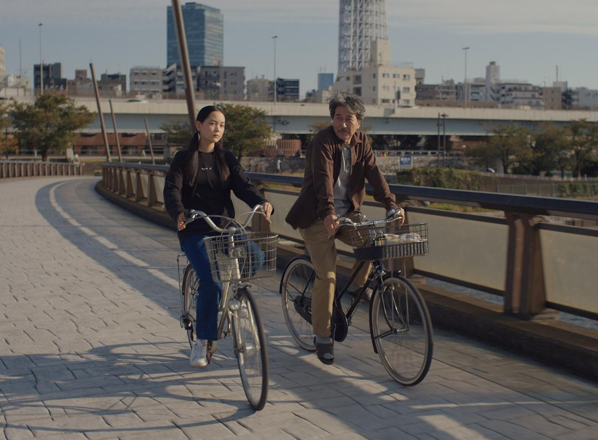
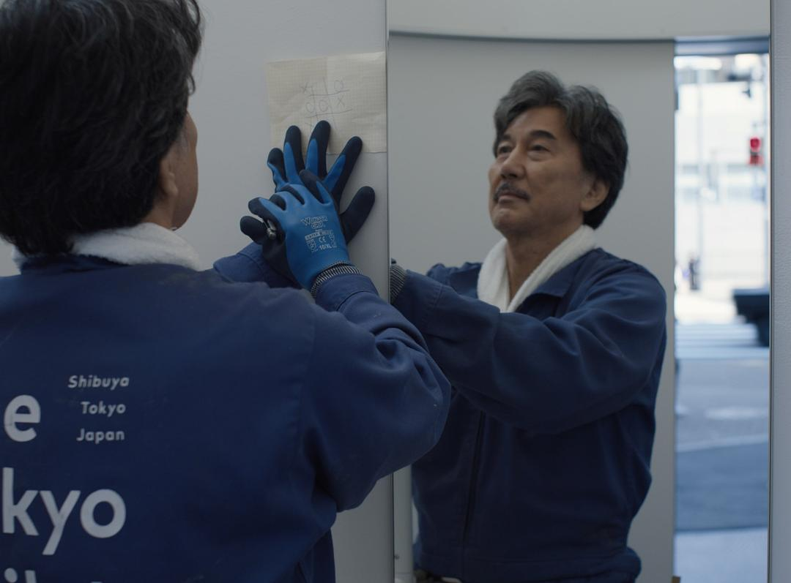
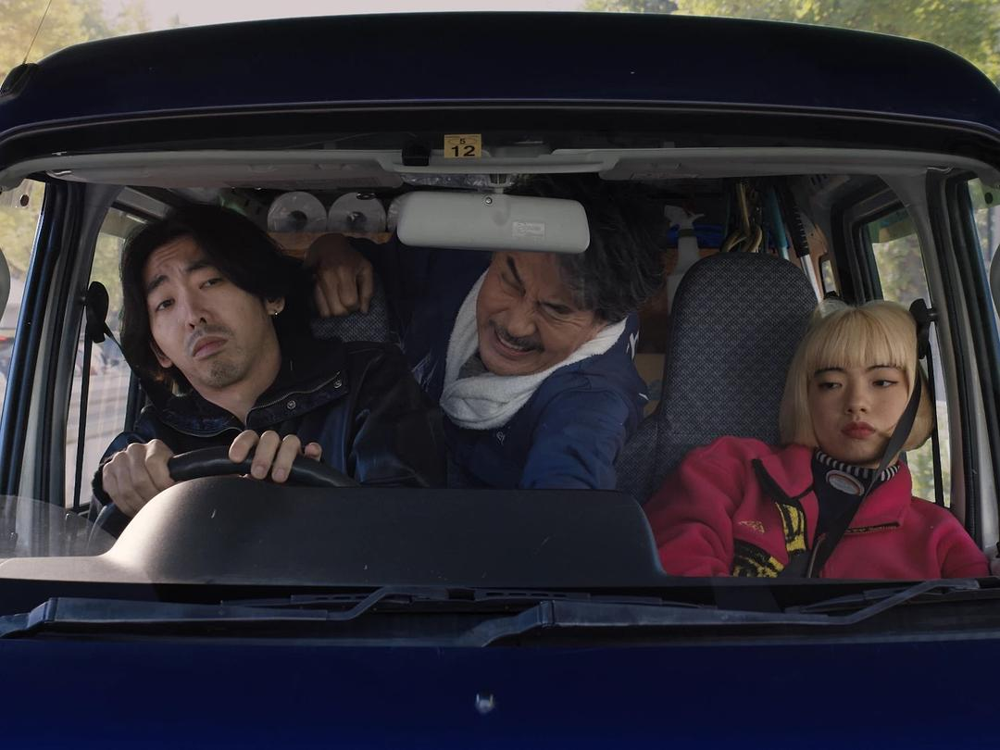

很多人都知道维姆·文德斯是小津安二郎的影迷，也听说过他们首次“相遇”的故事，那是1975年，文德斯在纽约林肯中心无意中观看了《东京物语》，看完之后意犹未尽，又连看了两场，从此成为了小津的忠实影迷。

1983年，小津去世二十年之后，文德斯为了拍摄纪录片《寻找小津》而流连于东京的街头，这座城市的光怪陆离令他大为震惊，“东京的真实情景，无情又严厉地打击着我”，他在纪录片中说，“小津电影中那种有爱的、有序的、神话般的东京，真的存在吗？”那时候的东京，已经与小津的东京相去甚远，或者小津时代的东京，也只是东京的一个幻象。

又过了四十年，文德斯再访东京。东京市政当局委托文德斯拍摄一个短片项目，目的是展示这个城市令人印象深刻的公共厕所系统。文德斯将自己的创意扩展为一部长片《完美的日子》，同时再次致敬了他的偶像小津安二郎——不仅影片男主的姓“平山”来自小津的最后一部电影《秋刀鱼之味》，且影片中所呈现的东京再次回到了小津的东京，一座被人为过滤成怀旧、静谧、有序的城市。

平山的一天从晕染到榻榻米上的第一抹橙色晨光开始。黎明时分，他被窗外一位老妇人用桦树扫帚清扫街道的声音叫醒，他叠好被褥，将它们整齐地堆放在角落里，然后开始刷牙、修剪胡须、换上工装。出门前，他会给窗口的小小盆栽植物们喷上水雾，他坐下来，花上几十秒钟静静地微笑着看着植物。接着他走出家门，仰望了一下天空，又微笑了起来。

役所广司饰演的平山是一位中年厕所清洁工，每天在微笑中出门，跳上一辆装满所有清洁用品的老式小货车，安详地穿梭于东京涩谷区各个造型现代的公厕之间。他在车上用老式磁带聆听六七十年代的经典摇滚乐：帕蒂·史密斯、卢·里德、地下丝绒乐队、滚石乐队……很显然文德斯将自己年轻时候的音乐品味附着在了平山身上，观众在此时会意识到，作为厕所清洁工，平山的音乐品味似乎有点与众不同，至少可以推测，他在年轻时候接触了大量西方音乐。

每到一处公厕，平山都会拿着刷子和拖把轻车熟路地开始手头的工作。他一丝不苟地擦洗洗手池，坐便器的各个部分也都擦拭干净，甚至用一面小镜子检查马桶的底部，确保没人看到的地方也闪闪发光。做着这些事情的时候，平山的表情平静，没有烦躁与嫌恶。偶然当厕所被占用，他退避到门外，仰望着树叶之间漏下的细碎阳光，又露出了微笑。当他身着蓝色工装穿梭于这些干净整洁的公厕之间，与其说是清洁工，不如说很像一个虔诚的僧侣穿着缁衣在各大寺庙巡礼。

他每天在公园的同一张长椅上吃自带的便当午饭，用胶片相机拍摄透过树梢的同一簇光线。下班后，他去当地的澡堂泡个澡，然后在同一家地下商店街的拉面店吃晚饭。平山当然也有同事，影片安排了一个笨手笨脚、浮躁懒散、不专心工作的年轻清洁工，这个角色更加衬托出了平山的安静、成熟和对工作的“虔诚”。

一天结束后，平山开始专注于自己热爱的文学作品，他在睡前阅读威廉·福克纳的作品，然后安然入梦，梦中光影婆娑，但依然平和阒寂。

第二天，文德斯又带我们重温了平山前一天的日程表，同样的工装、摇滚乐，对所有呈现在他感官上的事物都报以欣然接受的微笑，还有一丝不苟的擦拭、公园的便当、树枝在阳光下的摇曳和睡前的福克纳，甚至的梦的风格也相差无几。这样的生活节奏不禁要使观众发文：他是否也曾在低俗或随意中得到慰藉？周末，他骑车去洗衣店、书店、胶片冲印店和一家由熟识的妈妈桑经营的小酒馆，这些行程虽然不同，却同样有条不紊。

平山狭小而有禁欲气质的公寓里堆满了书籍、音乐磁带和一箱箱他用胶片冲洗出来的照片，显然他是一个非常聪明和有教养的人。后来的情节设置也让我们知道，他年轻时或许曾经享有优渥的生活条件，但出于某种家庭原因，他选择了离开原有的家庭。意外出现的姐姐（坐着豪车，有司机）向我们暗示了他与他父亲关系的破裂，并震惊于他现在的生活，但他也只是笑笑，没有多说话。只是在姐姐离开之后，他埋首流泪，这是影片为数不多的戏剧化情节。

对于东京来说，文德斯再一次成为了游客。影片剔除了任何灰尘或污垢，平山从来没有在公厕里发现任何我们可以想象得到的可怕的东西，那些公厕与其说是被他打扫得干干净净，不如说它们本身就很干净——而这是不可能的，只有在游客的眼中，东京的厕所才会如此干净。

与此相应的是，平山的劳动也显示出一种不同寻常的洁净。影片不遗余力地把特写镜头对准平山的劳动细节，却没有劳动带来的疲惫与烦恼。如果这是一部5D电影（带有气味的那种），观众将不会在平山进入公厕时闻到应该闻到的那些味道，剩下的只有一种抽象的美。劳动确实可以是美的，但劳动之美必与污秽相伴——体力劳动浸润着汗水、脑力劳动则伴随着精神的紧张与情绪的发泄，只有真正穿越过劳动所包裹的狭小阴暗的通道的人，才能在尽头看到劳动所散发的珍贵稀有的美，而一旦这种美被抹去前因后果、孤立地展示在观众面前的时候，镜头所对准的厕所清洁工这一底层劳动者群体，他们可以认同曾为富家子弟的平山吗？

平山的微笑同样令人困惑。我们确实已经知道他必然经历过生活的波折，或心灵上的风浪，他也曾挣扎于该如何面对自己的生活。现在的这种生活状态是这种这种挣扎与思考的结果，所以当他面对姐姐的震惊时，是一种坦然和自信。看起来，他已经获得了禅宗式“一饭一粥”的觉悟（见沩山禅师公案），然而，这种“微笑”依然是“有分别心”，是一种自满，或许还带有一点点骄傲，因为微笑对应着不笑。一旦有了分别心，他的这种生活就无法自洽，他便需要年轻时候的“品味”——摇滚乐、经典文学来构筑起自己的精神堡垒。这个精神堡垒并不稳固，现实的微小震动，比如给他排班多了，他就没有时间看书，他终于发火和主管抱怨。

对于平山这个角色来说，这种纯粹的生活也许是成立的，但是对于文德斯来说，他选择表现这样的生活，就不免让人稍觉遗憾。可资对比的相似的电影是香特尔·阿克曼的《让娜·迪尔曼》，影片同样对准了让娜的日常生活，事无巨细地就将让娜生活中琐碎与疲惫展现在观众面前，让娜的表情并不“淡然”，也不是“非淡然”，更不是某种微笑，而是一种真正的来自日常生活的“随机”，一种并非被安排的、需要对什么表现出满意或不满意的表情。这让人不得不想起苏轼的名言“着力即差”——当导演想要着力表现一种禅意的生活时，他自己便远离了禅的真意；而当导演无所着力地跟随着生活本身时，即使被摄的人物与禅毫无关系，导演本人便已经在践行禅。

然而，如果不将这部电影看成是导演的终极艺术观念的表达，而是导演在寻找一种对东京的怀旧之情的话，我们也许可以原谅那些不合情理的细节。

不管怎么说，作为甲方的东京市确实达到了目的，人们看到了漂亮的公厕建筑，它们点缀在涩谷的公园之中，导演安排了充足的镜头让观众去欣赏这些由建筑师设计的现代主义风格的公厕。对城市建筑的捕捉从文德斯的第一部电影就开始了，在拍《城市之夏》（1970）的时候，他特地去拍摄了维特根斯坦曾经住过的一幢房子，那个房子最终留在了电影里。文德斯曾说，他是一个不可救药的德国浪漫主义者。这样回想起来，平山可能也是一个浪漫主义者，他做的这些事情，也许并不是要践行某种哲思，而只是单纯怀念那些逝去的时光。