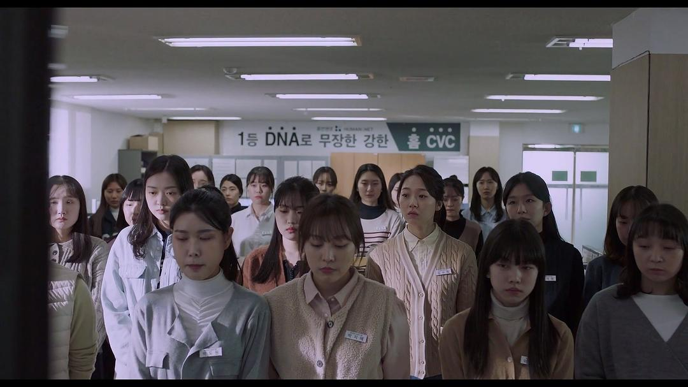
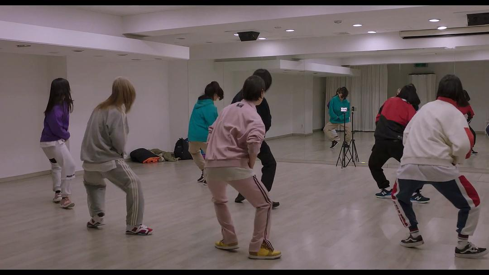

这届平遥国际电影展（6th PYIFF），以不思议的方式在年关之际降至。电影宫成了飘雪古城的中心，也是最温暖的一处地方。近十部电影看下来，韩国导演郑朱莉《下一个素熙》是我最满意的一部。可以说，它在开场不久，因手机直播导致，发生在餐馆的一个起手式，就已经完胜绝大多数同期展映的华语电影——在涉猎相同、相近议题的情况下，这样的同台较量，水平高低一眼可见。显然，在全球化或抗击疫情的大背景下，不同地方的创作者，大抵都在思考相似的，全球化红利与数字自由魅惑下，人被推拉牵引，最终变形和异化的普遍性问题。然而，受阻于种种原因，华语电影往往只有一出安全的套路拳法，无法呈现更加复杂，参差多态的深度解读。

郑朱莉前作《道熙呀》，也是关于一个名带熙字的女孩，也是由裴斗娜主演。不过，作为八年前的电影，我记忆无多，只记得人物关系情感，暧昧不清。此番《下一个素熙》，却把批判现实的主题，彻底挑明：韩国社会没能注意和保护好底层年轻人（就读于职业学校的年轻人），反而把他们一次性打包，倒手转卖，送入残酷的社会齿轮下，充当廉价的血色润滑剂。

作为主人公，片名中的素熙，在有“下一个”的同时，似乎还存在“上一个”，或“前一个”素熙（如同《黑暗荣耀》的受害者）。如电影所描绘的，素熙作为主体，也是一名受害者，却被外包公司压榨，被职业学校抛弃，一再被涂抹，不断遭致有错，有罪论，是个问题学生。公司以高压打击（PUA）为主，学校以“为了你好”（教条）为诱引，合力将素熙变成了柱状图和数据表上的一个隐形数字。素熙在电影里，是可见的，灵动的，会率先砸破青春鱼缸的少女。而在结构和建制层面上，她是不可见的，是一个日常潜伏，总会出现，大家争相想要甩掉的麻烦。

当活生生的个体变成了统计学层面的大数据——如同当下捆绑着每个人的智能手机，她的爱好，她的欢乐与悲伤，都被锁在了手机之中。

孤独？

素熙没有开口说过这个词。她踩着拖鞋，独自走在冷清的路上。一次次直接爆发的冲突中，素熙是一个会为朋友撑腰，看不惯就出手的血性年轻人，然而，当她有了自己的麻烦，朋友们帮不上，家长始终局外迷糊。

《下一个素熙》呈现了一个“意外的结构”。在前半段，素熙变成了KPI考核下，一头追逐胡萝卜的驴子。电影不断重复这些业务员，如何在日夜无休的语音轰炸中，分门别类地应付难缠顾客，诱导他们继续消费，维护大公司利益。她们是汇集声音、吸纳并消音的墙壁（片中有一段表现声音如何铺天盖地、潮水巨浪般袭来的场景），如同被大公司外包到印度等人力密集国家，充当全球猎身的客服团队。这个故事虽然发生在韩国全州，但合同薪金毫无保障，处于成年关卡的素熙，基本上充当了一个被剥削，设计，随时可替换的螺丝钉。换言之，这份工作除了忍耐和重复，并没有其他多余价值，由随时可被甩手的菜鸟实习生来担任，再适合不过。

在后半段，当素熙的朋友和工友，一个接一个，被召唤到镜头前。我惊讶发现，他们看起来懦弱、笨拙、可笑、胆怯、孤独的罅隙，居然全部都有合理的性格晖照。电影前半段，当素熙在场时，观众会留意到前辈的不贴心，在工厂里充当受气包。闺蜜的逃避，近乎自毁的吃播方式，没心没肺。工友的城府，表现出素熙抵触，无法接受的老成世故。当他们觉得对素熙有所愧疚的时候，电影的群像塑造，也动人了起来。原来“下一个”，很可能，或本应该是他们——他们没有成为素熙，选择变成了另外一个样子。

电影里的现实，离我们并不遥远，甚至过于接近。那根压死骆驼的稻草，很可能就是提升效率要求下，每单快了三秒的外卖配送，或是直播下方评论，一句句难听的、骂人的话。从社会达尔文爱好者的角度来说，素熙的背后，只是一桩无法扛住压力的悲剧，她的硬度足够，韧性却不够。实际上，选择用这样的词汇来描述一个人，那多少已经不近人情了。是的，她没有像其他人那样扛住压力。然而，当所有人都扛着天花板的压力，压力只会越来越重，越沉。人，终归不是机器。在全球化与大数据的美好幻觉中，享受速度与快乐的，好像是手机。感受痛苦的，却是真实的，个体的人类。所有东西看起来都触手可及，任何一个人二十四小时随时随地都应该被找到，但最后，人与人之间，还是隔了一张纸——比纸还薄，透明的，不可名状的，无法穿透的东西。它将每个人，与其他人隔离开来，也将素熙和这个世界，区隔开来。这是人之所以为人的珍贵所在，也是素熙之所以为素熙的悲剧所在。